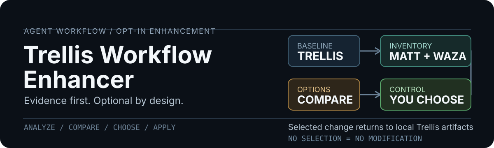

<p align="center">
  
</p>

[中文](./README.zh-CN.md)

# Trellis Workflow Enhancer

An opt-in skill for improving an existing Trellis workflow without handing
control to another framework. It inventories the repository, verifies currently
installed and upstream Matt Pocock and Waza capabilities, then presents a
before-to-after decision table. Nothing changes until the user chooses options.

## What It Produces

The first run is analysis only. It gives the user:

- evidence from the repository's Trellis config, workflow, specs, tasks, and
  real validation commands;
- current local and upstream skill evidence, without silently updating either;
- an explicit enhancement comparison with benefit, cost, risk, prerequisites,
  and the exact affected files;
- a `no change` option alongside every recommended bundle.

## Before And After

| Before | Optional after |
| --- | --- |
| Generic workflow suggestions that may ignore repository shape | Package/spec scope grounded in the real Trellis parser and module roots |
| Planning is shallow when product or domain decisions are unclear | One verified deep decision route, with decisions returned to Trellis artifacts |
| Tests, diagnosis, and manual checks blur together | A named feedback loop, TDD only at a real seam, and reproduction before repair |
| All changes receive the same review cost | Independent review only for declared risk classes |
| Visual work can escape the engineering plan | Waza visual exploration returns states and acceptance criteria to `design.md` |
| Tool popularity decides integration | Observed gaps, explicit tradeoffs, and user-selected IDs decide integration |

## How It Works

1. **Inventory**: read the target's Trellis files, task state, specs, code
   structure, and executable validation surface.
2. **Verify**: inspect installed Matt/Waza skills and compare them with their
   official upstream sources in read-only mode.
3. **Compare**: show a compact `ID | before | optional after | benefit | cost`
   table, including `N0` for no change.
4. **Choose**: wait for the user to select IDs, bundles, or no change.
5. **Apply**: make only selected, project-local integrations and verify them.

Trellis continues to own task lifecycle, package scope, specification loading,
and acceptance evidence. Matt and Waza are never copied into the project or
treated as a competing task system.

## Install

```bash
npx skills@latest add lei1024/trellis-workflow-enhancer
```

## Use

```text
Use $trellis-workflow-enhancer to inspect this repository's Trellis workflow,
compare it with the latest verified Matt and Waza skills, and present optional
enhancements before changing any files.
```

## Optional Bundles

| ID | Bundle | Typical trigger |
| --- | --- | --- |
| S1 | Scope and specs | multi-root codebase, stale templates, or ambiguous ownership |
| D1 | Decision and knowledge | unclear product rule, domain term, UX state, or module ownership |
| F1 | Feedback and diagnosis | behavior change, missing confidence, bug, or performance regression |
| R1 | Independent review | shared module, auth, migration, public contract, or high-risk UI path |
| V1 | Visual iteration | UI behavior, hierarchy, responsive state, or screenshot-grounded change |
| H1 | Workflow health | non-trivial repository needs a read-only maintainability audit |
| N0 | No change | existing Trellis workflow already fits the repository |

The catalog and comparison template are intentionally generic. The skill removes
unsupported rows rather than forcing every bundle into every repository.

## Safety Rules

- Never modify a target before an explicit option selection.
- Never claim a locally installed skill is the latest without an upstream check.
- Never auto-install or update Matt, Waza, Trellis, global settings, or hooks.
- Never change `.gitignore`, stage, commit, push, archive tasks, or rewrite
  history as part of an enhancement recommendation.
- Never invent test commands. State the missing test or manual-verification gap.
- Never expose secrets, private URLs, user data, or internal infrastructure in
  the comparison report or durable local documentation.

## Sources

The skill uses the official [Matt Pocock skills repository](https://github.com/mattpocock/skills)
and [Waza repository](https://github.com/tw93/Waza) as read-only upstream
sources. It verifies names and versions at analysis time because both catalogs
change independently.

## Repository Layout

```text
trellis-workflow-enhancer/
├── SKILL.md
├── README.zh-CN.md
├── agents/openai.yaml
├── assets/readme/hero.svg
└── references/
    ├── comparison-template.md
    └── integration-catalog.md
```

## License

[MIT](./LICENSE)
